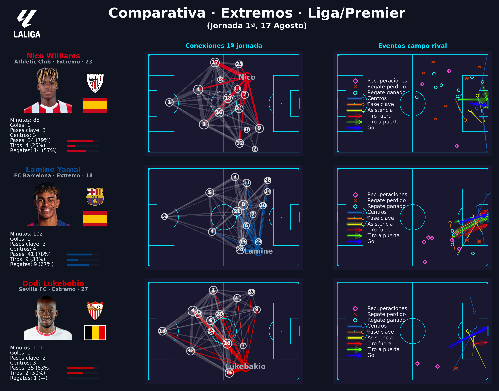

# 📊 Comparativa de jugadores · Liga / Otras

Proyecto de visualización de datos para comparar actuaciones de posicones en partidos de **LaLiga**, **Premier League** ... utilizando eventos en formato Opta (coordenadas 0–100), a través de Whoscored.

El dashboard combina:
- **Tarjeta resumen** con foto, escudo, bandera y métricas clave.
- **Mapa de conexiones** (red de pases en la primera jornada).
- **Mapa de acciones en campo rival**, incluyendo: (ejemplo extremos)
  - Goles
  - Tiros (a puerta / fuera)
  - Asistencias
  - Pases clave
  - Centros
  - Regates (ganados/perdidos)
  - Recuperaciones

Los gráficos se exportan como imágenes de alta calidad listos para informes o redes sociales.

---

## 🚀 Instalación

1. Clona este repositorio:
```bash
git clone https://github.com/tu_usuario/comparativa_extremos.git
cd proyecto_comparativa_25_26


## Estructura

proyecto_comparativa_25_26/
│
├── notebooks/
│   └── comparativa_extremos.ipynb   # Notebook principal de visualización
│
├── utils/
│   ├── visualizaciones.py           # Funciones generales de gráficos
│   └── visualizaciones_ext.py       # Funciones específicas para extremos
│
├── data/
│   ├── masters/                     # CSVs maestros (ids jugadores, etc.)
│   ├── matches/                     # CSVs de eventos por partido (ignorado en git)
│
├── images/
│   └── logos/                       # Escudos
│   └── flags/                       # Banderas
│   └── players/                     # Fotos de juggadores
│
├── outputs/
│   └── dashboards/                  # PNGs exportados hoja 1
│   └── tablas/                      # PNGs exportados hoja 2
│
├── README.md
├── requirements.txt
└── .gitignore

## Ejemplo



